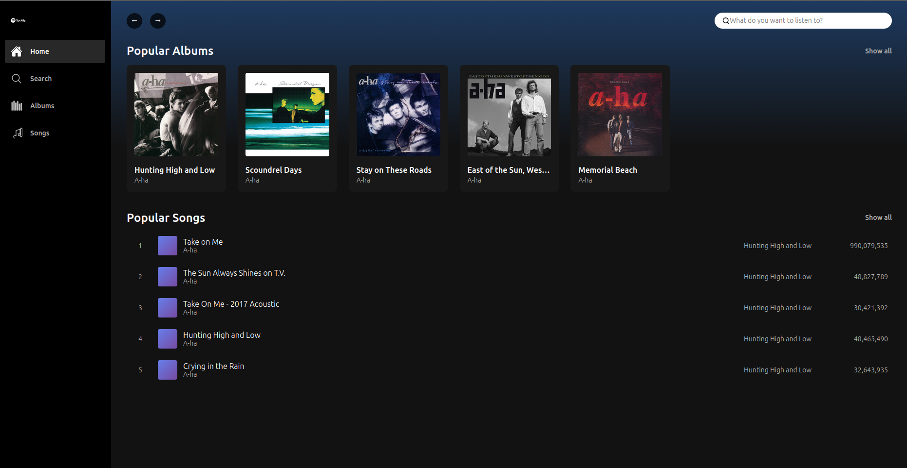

# Copify

A modern web application for browsing and managing music albums and songs, inspired by Spotify's clean and intuitive design.

## Team Members

- **Adnan Šemić**
- **Ahmed Spahić**

## Application Overview

Copify is a music catalog application built with Spring Boot and Thymeleaf that provides users with an elegant interface to explore albums, songs, and artists. The application features a dark-themed, Spotify-inspired UI with full search capabilities and detailed views for albums and individual tracks.

## Data Model and Relationships

The application is built around two primary models with a clear relational structure:

### Album Model

The `Album` class represents a music album with the following attributes:

- `id` (Long) - Unique identifier
- `name` (String) - Album title
- `artist` (String) - Artist or band name
- `imageUrl` (String) - Cover art URL
- `releaseYear` (String) - Year of release
- `followers` (int) - Number of followers
- `songs` (List<Song>) - Collection of songs in the album

### Song Model

The `Song` class represents individual tracks with the following attributes:

- `id` (Long) - Unique identifier
- `title` (String) - Song title
- `artist` (String) - Artist name
- `album` (String) - Album name
- `albumId` (Long) - Foreign key reference to Album
- `duration` (String) - Song length (mm:ss format)
- `plays` (long) - Number of plays/streams
- `liked` (boolean) - User favorite status

### Relationship Structure

**One-to-Many Relationship**: Each Album can contain multiple Songs, while each Song belongs to exactly one Album. This relationship is maintained through the `albumId` foreign key in the Song model, linking songs to their parent album.

The data layer uses `LinkedHashMap` collections for efficient storage and retrieval, with auto-incrementing sequence counters for ID generation.

## Features

- **Home Dashboard** - Featured albums and popular songs
- **Albums Browser** - Grid view of all available albums
- **Songs Library** - Comprehensive list of all tracks
- **Search Functionality** - Real-time search across albums and songs
- **Album Details** - Detailed view with complete tracklist
- **Responsive Design** - Optimized for desktop and mobile devices
- **Dark Theme** - Modern, Spotify-inspired interface

## Technology Stack

- **Backend**: Spring Boot 3.5.7
- **Template Engine**: Thymeleaf
- **Build Tool**: Maven
- **Java Version**: 17
- **Additional Libraries**: Lombok for boilerplate reduction

## Application Screenshot



## Project Structure

```
src/
├── main/
│   ├── java/
│   │   └── org/
│   │       └── fakultet/
│   │           └── vjezba3/
│   │               ├── controller/
│   │               │   └── HomeController.java
│   │               ├── data/
│   │               │   └── DemoData.java
│   │               └── model/
│   │                   ├── Album.java
│   │                   └── Song.java
│   └── resources/
│       ├── templates/
│       │   ├── index.html
│       │   ├── albums.html
│       │   ├── songs.html
│       │   └── album-detail.html
│       └── application.properties
```

## Routes

- `/` - Home page with featured content
- `/albums` - All albums view
- `/albums?search={query}` - Album search results
- `/album/{id}` - Album detail page
- `/songs` - All songs view
- `/songs?search={query}` - Song search results
- `/search?q={query}` - Global search

## Running the Application

```bash
./mvnw spring-boot:run
```

The application will be available at `http://localhost:7777`
